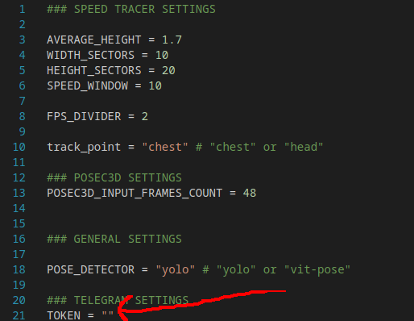

# Чат-бот в Telegram для детекции резкого ускорения
Предназначен для детекции бега, прыжков, рывков, резких разворотов.
## Использование
После ввода команды `/start` бот вас поприветствует. Далее вы можете выбрать детектор (YOLOv8 работает быстрее, а ViTPose надёжнее), либо отправить видео длительностью более двух секунд. Через некоторое время после отправки появится сообщение о том, что началась обработка, а ещё через несколько минут (в зависимости от выбранного детектора) появится обработанное видео.


## Самостоятельный запуск
### Клонирование репозитория и настройка:
С помощью команды `git clone https://github.com/PeshkovMikhail/rapid_accel_detector` клонируйте данный репозиторий, после чего в файле config.py передайте переменной TOKEN значение токена вашего чат-бота в Telegram.



### Установите зависимости:
```
pip install -r requirements.txt
```

### Запуск
Введите:
```
python inference.py
```