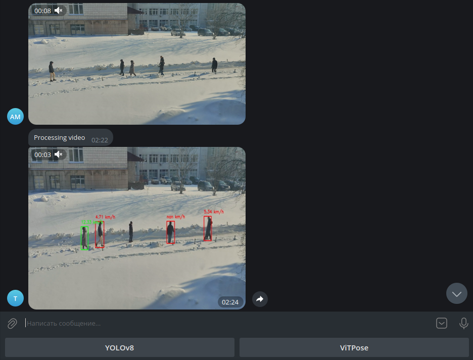

# Чат-бот в Telegram для детекции резкого ускорения
Предназначен для детекции бега, прыжков, рывков, резких разворотов.
## Использование
После ввода команды `/start` бот вас поприветствует. Далее с помощью кнопок под строкой ввода вы можете выбрать детектор (YOLOv8 работает быстрее, а ViTPose - надёжнее), либо отправить видео длительностью более двух секунд. Через некоторое время после отправки появится сообщение о том, что началась обработка, а ещё через несколько минут (продолжительность ожидания зависит от выбранного детектора) появится обработанное видео.



## Запуск в docker
После клонирования и настройки перейдите в репозиторий и введите:
```
docker build . -t rapidaccelbot
docker run -e TELEGRAM_TOKEN="TELEGRAM_TOKEN" rapidaccelbot
```